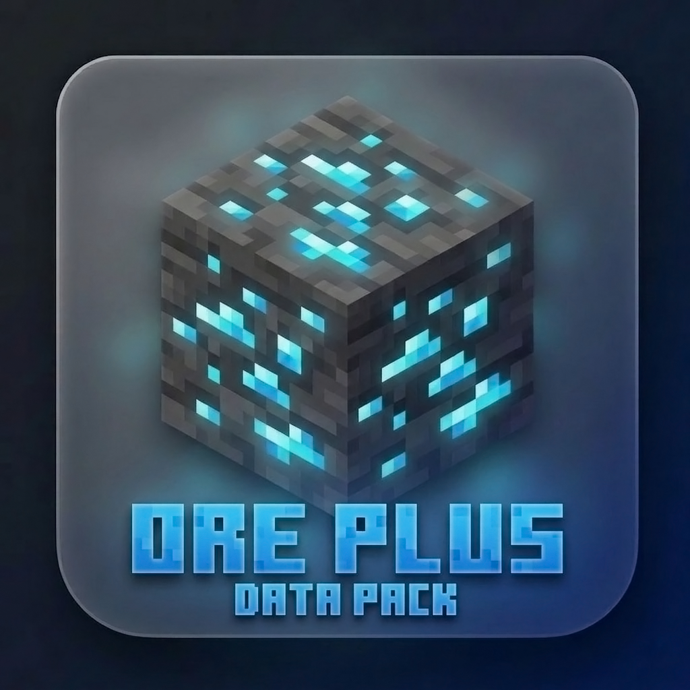

🌐
<a href="https://github.com/wen-wen520/Minecraft.Datapack-Ore_Plus">English</a>
&nbsp;|&nbsp;
<a href="https://github.com/wen-wen520/Minecraft.Datapack-Ore_Plus/wiki/%E4%B8%AD%E6%96%87%E4%BB%8B%E7%BB%8D">中文</a>

<h1>
Ore Plus Datapack
</h1>

    

## 📋 Overview

This datapack modifies the default ore generation in Minecraft, primarily increasing the spawn rates of certain minerals.

Created with 💗 by wen_wen

## ❇️ Features

### No Mod Loaders Required: 
This datapack works seamlessly with vanilla Minecraft, requiring no additional mod loaders or software.

### Wide Compatibility: 
Designed to integrate smoothly with various Minecraft worlds and setups, ensuring minimal conflicts.

### Enhanced Ore Generation: 
Increases the spawn rates of specific minerals, making resource gathering more efficient.

## 📖 Detail

### Rate Table

The table below shows the modified ore generation probabilities after the datapack is applied. 

Please note that the names of the packs do not reflect the directly multiplied probabilities from the vanilla rates, 
but rather the extent to which the datapack modifies the original ore generation probabilities.

>[!Note]
>The Ultra Datapack will also modify the range of ore generation, from 0 to 256, to make sure all ore can generate.

| Ore Name  | Ore Type | Vanilla Rate | Datapack x2  | Datapack x4  | Datapack Ultra |
|:----------:|:--------:|:------------:|:---:|:---:|:-----:|
| Coal      | Ore      | 20           | 35  | 64  | 128   |
| Iron      | Ore      | 20           | 35  | 64  | 128   |
| Lapis     | Ore      | 3            | 12  | 28  | 128   |
| Gold      | Deltas   | 20           | 35  | 64  | 128   |
| Gold      | Extra    | 20           | 35  | 64  | 128   |
| Gold      | Ore      | 2            | 10  | 26  | 128   |
| Redstone  | Ore      | 8            | 14  | 30  | 128   |
| Diamond   | Ore      | 1            | 8   | 24  | 128   |
| Emerald   | Ore      | 5            | 12  | 28  | 128   |
| Debris    | Large    | 1            | 8   | 24  | 128   |
| Debris    | Small    | 1            | 8   | 24  | 128   |
| Quartz    | Deltas   | 32           | 40  | 80  | 128   |
| Quartz    | Nether   | 32           | 40  | 80  | 128   |
| Gold      | Nether   | 20           | 35  | 64  | 128   |

Rates also listed on the download page on modrinth\
And also feel free to refer to [wiki](https://github.com/wen-wen520/Minecraft.Datapack-Ore_Plus/wiki) for more details
## ⚙️ Versions

### Now Support

Minecraft: `1.16.2 -1.16.5`\
Datapack Format: `6`\
**x2** **x4** and **Ultra** are available

### Is Supporting

mc `1.17 1.18 1.19 1.20 1.21` are on the way here

### Not Support

below `1.16.1` (Included)\
The key part to modify ore pre generated `worldgen` has not been introduced to datapack

## ✅ Installation

### Download

Modrinth [[⬇️ Download]](https://modrinth.com/datapack/ore_plus/versions) provides a modern UI to choose and download this datapack, Detailed rates also has been listed on download page

Github [[📦 Realse]](https://github.com/wen-wen520/Minecraft.Datapack-Ore_Plus/releases) Page is good to get the source code and pack them by self

Github [[🔧 Action]](https://github.com/wen-wen520/Minecraft.Datapack-Ore_Plus/actions) can be used to get the lasted dev build

### Install
Strongly recommand to install at the creation of a world

When creating a new world\
Find the **Data Paks** Option\
Click and drag the data pack to Minecraft\
Then move the data pack to the right hand side and click **Done**

[For detailed steps](https://minecraft.wiki/w/Tutorial:Installing_a_data_pack)

## 📃 Feeadbacks

Welcome to [📑Issue Page](https://github.com/wen-wen520/Minecraft.Datapack-Ore_Plus/issues/new/choose) to submit any bugs or featuers.

## 📜 License

## 🎉 Thanks & Related Resource

[Minecraft](https://www.minecraft.net/)\
Provide the vanilla game (:

[Minecraft Wiki](https://minecraft.wiki/)\
Resource, Guide and Infomations

[Minecraft Title Generator](https://github.com/ewanhowell5195/MinecraftTitleGenerator)\
Use for assets in this project

[Xray Ultimate Resource Pack](https://www.curseforge.com/minecraft/texture-packs/xray-ultimate-1-11-compatible)\
Can exactly show the ores underground, used in gallery